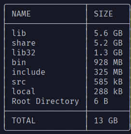

# Description

Shows the size of each directory below user specified directory or current working directory if none specified.

## Usage

```text

Usage: duble [--root-only] [--list-all] DIRNAME

Positional arguments:
  DIRNAME

Options:
  --root-only, -r        List only the files in root directory/the passed directory name. [default: false]
  --list-all, -a         Additionally list hidden files and directories. [default: false]
  --help, -h             display this help and exit
```

## Example Terminal Output


